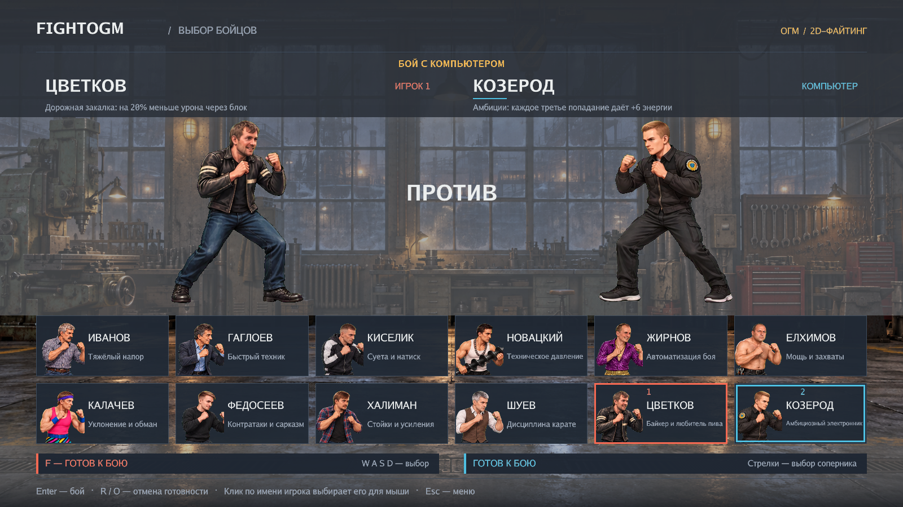
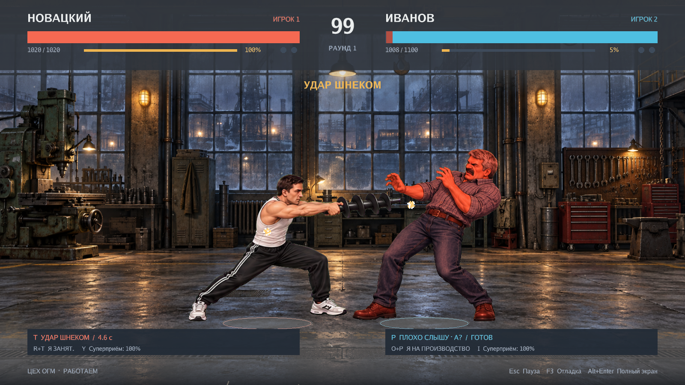

# FIGHTOGM 2D

**Производство не останавливается.** Нативный файтинг на Go и raylib с видом сбоку,
рисованными 2D-персонажами и интерфейсом на русском. Доступны **12 бойцов**:
Иванов, Гаглоев, Киселик, Новацкий, Жирнов, Елхимов, Калачев, Федосеев, Халиман, Шуев,
Цветков и Козерод.
Можно играть против компьютера или вдвоём на одной клавиатуре, выбирая любую пару.



## Запуск

Готовая Windows-сборка распространяется архивом `FightOGM-windows-x64.zip`.
Распакуйте его целиком и откройте `FightOGM.exe`. Если скачаны исходники репозитория,
сначала выполните сборку по разделу «Сборка и проверки» ниже.

Запустите **run.bat** или **dist/FightOGM.exe**. Выберите «Бой с компьютером» либо
«Два игрока». В сетке выбора WASD выбирают первого бойца, стрелки — второго
(включая соперника-компьютер). Enter начинает бой; вдвоём можно подтвердить
готовность отдельно клавишами F и J, отменить — R и O. Мышью сначала нажмите
на имя игрока над большим персонажем, затем на карточку бойца и «Готов».

Папка **dist** содержит готовую переносимую Windows x64 сборку. Копируйте её целиком.
Для запуска не нужны Go, Python или GCC. Нужны видеодрайвер с OpenGL 3.3 и файлы
assets из этой же папки. Лог запуска: logs/fightogm.log.

## Управление

Клавиши указаны по английским буквам на клавиатуре.

| Действие | Игрок 1 | Игрок 2 |
|---|---|---|
| Влево / вправо | A / D | ← / → |
| Прыжок / присед | W / S | ↑ / ↓ |
| Лёгкий удар | F | J |
| Сильный удар | G | K |
| Удар ногой | H | L |
| Захват вблизи | F + G | J + K |
| Блок | удерживать R | удерживать O |
| Особый приём | T | P |
| Второй приём | R + T | O + P |
| Суперприём при 100% энергии | Y | I |
| Пауза | Esc | Esc |
| Полный экран | Alt + Enter | Alt + Enter |
| Отладка и зоны ударов | F3 | F3 |

- Присед + удар ногой — подсечка. Движение к сопернику + сильный удар — хук.
- Захват пробивает блок. Лёгкий удар можно продолжить сильным и ударом ногой.
- Можно перепрыгнуть соперника; бойцы автоматически разворачиваются друг к другу.
- У Иванова «Плохо слышу» временно снижает урон и оглушение, «Я на производство»
  даёт невидимость на 3 секунды, а «Омни» действует 8 секунд и открывает Омни-рывок на T / P.
- Раунд длится 99 секунд. Матч — до двух побед. При равном здоровье раунд переигрывается.

В режиме с компьютером вы управляете игроком 1. Настройки громкости, разрешения,
полного экрана и привязки клавиш сохраняются в config/settings.json.

## Бойцы и приёмы

| Боец | Особый приём | Второй приём | Суперприём |
|---|---|---|---|
| Иванов | Плохо слышу | Я на производство | Омни Иванов |
| Гаглоев | Шампур контроль | Быстрые руки | Шашлык готов |
| Киселик | Суета | Да, сделаю! | Всё беру |
| Новацкий | Удар шнеком | Я занят. | Шнековый напор |
| Жирнов | ИИ-агент | Автопилот | Сделай за меня |
| Елхимов | Ключ на 32 | Починил | Капремонт |
| Калачев | Водоподготовка | Меня не было | Перерыв |
| Федосеев | Ну да, конечно | Медленные аплодисменты | Гениальный план |
| Халиман | Импульс ПЛК | Режим качалки | АСУ ТП |
| Шуев | Серия карате | Стойка | Без выходных |
| Цветков | Пенный залп | Байкерская стойка | Полный газ |
| Козерод | Дуговой разряд | Перезарядка | Проект: Перегрузка |

У каждого свои характеристики и пассивная способность, указанная на экране выбора.
Робот, вода, волна сарказма, электрический импульс, пена и дуговой разряд
имеют отдельные 2D-эффекты.

**Новацкий — боец с чёрным шнеком.** Держит промышленный шнек из референса `Shnek.jpg`
в стойке, движении и атаках. Лёгкий удар — тычок, сильный — замах шнеком.
«Удар шнеком» — ближний удар с заметным замахом, одним попаданием и отбрасыванием;
его можно заблокировать или избежать, отойдя за пределы оружия.
«Шнековый напор» — три удара, последний сбивает с ног. Оружие остаётся в руках.



**Цветков — байкер и любитель пива.** Выпускает пену из кружки, принимает
защитную стойку и проводит мощный рывок «Полный газ». Пассивно получает на 20%
меньше урона через блок; захваты эту защиту обходят.

**Козерод — амбициозный электронник.** Стреляет электрическими разрядами.
«Перезарядка» даёт 12 энергии и на 6 секунд сохраняет заряд: следующий
разряд или суперприём наносит на 35% больше урона, после чего заряд расходуется.
Каждое третье попадание без блока даёт ещё 6 энергии. «Проект: Перегрузка» — три разряда подряд.

## Что изменено в 2D

- Рисованные спрайты всех двенадцати бойцов: 432 отдельные позы и 205 игровых анимаций.
- Лица, причёски и одежда подготовлены по фотографиям и листам референсов каждого бойца.
- Вид сбоку, движение влево/вправо, прыжок и присед; одна плоскость боя.
- При подходе боец останавливается у соперника; камера в ближнем бою сохраняет положение.
- Отдельные кадры замаха, контакта и восстановления. Контакт синхронизирован с уроном.
- Рисованная арена цеха, тени, искры попаданий, остановка кадра и встряска при ударе.
- Игроки различаются цветом интерфейса, маркером у ног и лёгким оттенком спрайта.
- Компьютер использует обычное управление и общие правила урона, энергии и восстановления.

Анимация покадровая; у обычной атаки три ключевые позы. Для более плавного движения
можно дальше добавлять промежуточные кадры в существующие листы и анимации.

## Сборка и проверки

Проверенная среда: Windows x64, Go 1.23.1, MinGW-w64 GCC в PATH;
raylib-go v0.55.1 зафиксирован в go.mod. При первой загрузке модулей нужен интернет.

```powershell
.\build.bat
.\run.bat
```

Скрипт выполняет go test ./... и go build ./..., собирает dist/FightOGM.exe,
копирует спрайты, фон, звук и лицензии. Существующие настройки игрока сохраняются.
Кэши Go расположены в .tools. Ранее собранные копии GLB внутри dist удаляются;
исходные модели проекта сохраняются.

Проверка реального рендера в скрытом окне:

```powershell
.\dist\FightOGM.exe -assets-root D:\FightOGM\dist -smoke-test -output D:\FightOGM\test-output\2d-expansion-dist
```

Она проверяет 432 кадра, удаление зелёного фона шейдером, выбор по сетке и мышью, оба режима
игры, зеркальный бой каждого персонажа, все 36 особых действий, шесть типов снарядов,
обычные удары, блок, прыжок, полный матч, паузу и реванш. Сохраняет PNG-кадры
и report.json. Модульные тесты также проверяют бой компьютера за каждого из двенадцати бойцов,
расход и истечение заряда Козерода, его пассивную способность и защиту Цветкова.
Дополнительная статическая проверка: go vet ./... при настроенных кэшах Go.

## Структура и добавление бойцов

- assets/sprites/roster.json — список доступных 2D-бойцов и фон арены.
- assets/sprites/ivanov/*.png — шесть листов спрайтов на зелёном фоне.
- assets/sprites/ivanov/animations.json — прямоугольники кадров, опорные точки и анимации.
- assets/sprites/<id>/ — по три листа (movement, attacks, actions) и animations.json
  для каждого из остальных одиннадцати бойцов.
- assets/backgrounds/ogm-workshop.png — фон цеха.
- internal/render/renderer2d.go — исключительно 2D-отрисовка и хромакей.
- internal/game — боевая симуляция 120 шагов/с и компьютерный соперник.
- internal/ui — русский интерфейс, меню и управление.
- scripts/sprites/build_manifest.py — анализ листов и построение JSON; PNG не изменяет.
- scripts/sprites/build_roster.py — построение JSON для остальных бойцов;
  можно указать ID, например: `python scripts/sprites/build_roster.py tsvetkov kozerod`.
- assets/source/2d/README.md — происхождение изображений и точные запросы генерации.

Для нового персонажа нужны определение приёмов, папка спрайтов с animations.json
и запись в roster.json. Все двенадцать определений из internal/characters включены
в текущую игру. Старые 3D-исходники и инструменты остаются в проекте
для справки; игра не загружает GLB. Предыдущая документация — assets/source/legacy3d/README.md.
